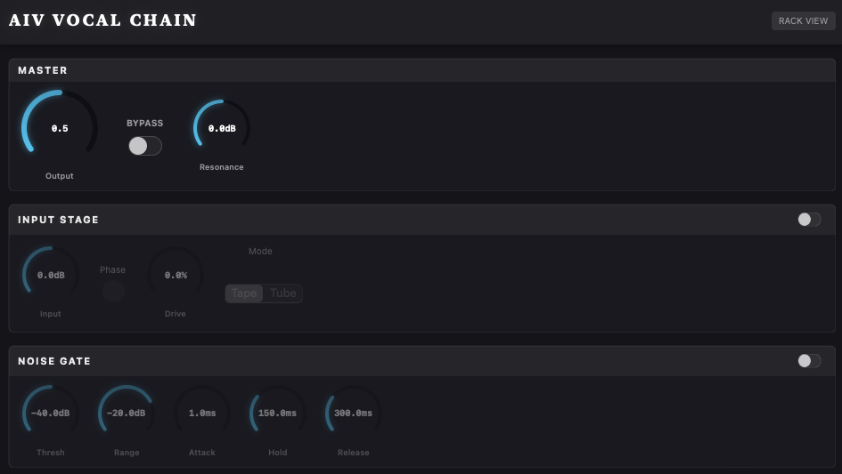
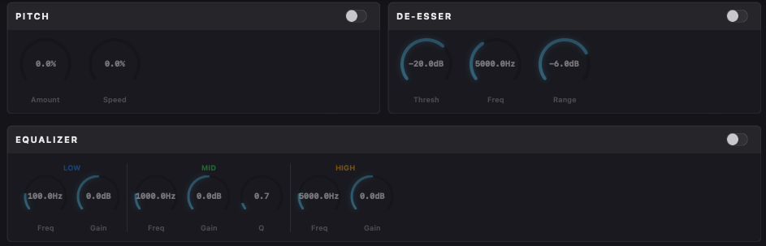
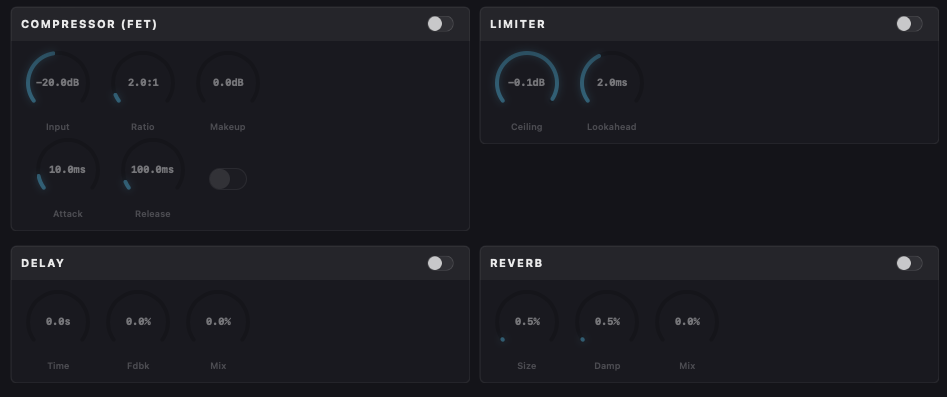

# Logic Pro Plugins by iairu

LogicAIV Alpha Release - Adjusting Vocals (Vocal Chain), inspired by Nectar 4, made with Gemini 3 Pro High and Antigravity alongside Gemini Deep Research

## VST3 - Maybe in the future

WIP Zone VST - adjusts sounds to fit ZUN's touhou soundtracks (harmonie navyse, compress+eq, analyza hlasu, tvorba vocal chainu)

WIP AIV VST - Adjusting Vocals (Vocal Chain), inspired by Nectar 4